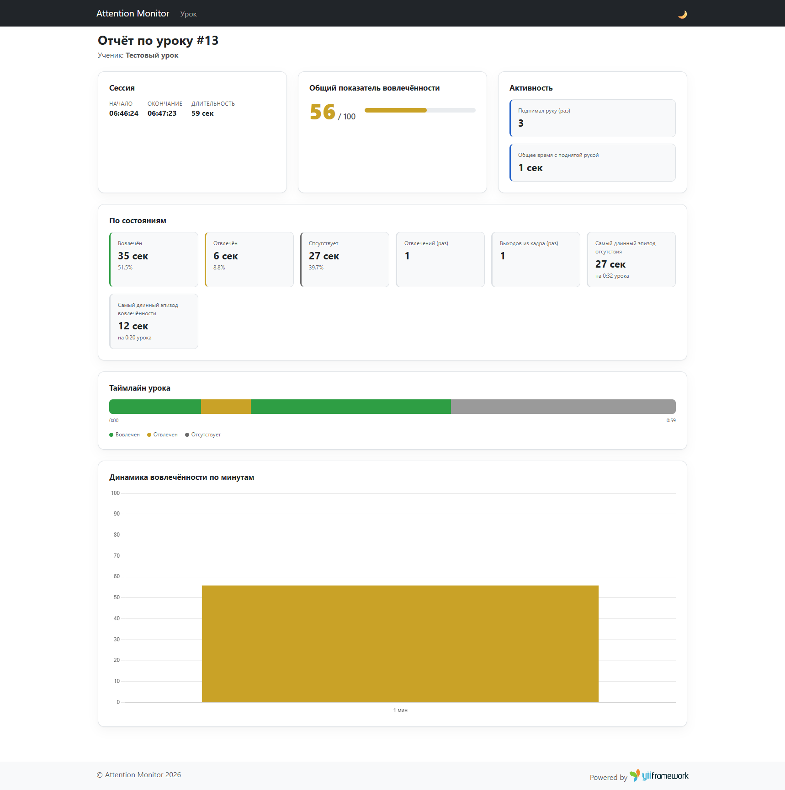

# attention-monitor

Yii2-модуль для тестового задания: прототип системы, которая через веб-камеру
отслеживает вовлечённость ученика во время урока и показывает учителю отчёт.
Видео и изображения с камеры никогда не покидают браузер — на сервер уходят
только метки состояний и временные метки.

Текст исходного задания — [docs/task.md](docs/task.md).

## Демо

Видео запуска и работы (смена состояний перед камерой → завершение урока →
отчёт): [docs/demo.mp4](docs/demo.mp4).

Страница отчёта:



## Запуск через Docker (рекомендуется)

Нужен только Docker — PHP/Composer на хосте не требуются.

```bash
docker compose up --build
```

Образ сам ставит зависимости (`composer install`) и применяет миграции при
каждом старте контейнера (идемпотентно), затем поднимает встроенный сервер
PHP на `0.0.0.0:8080`. БД — SQLite-файл в volume `runtime_data`, переживает
`docker compose restart`/`down` (без `-v`).

Страницы:
- `http://localhost:8080/lesson` — урок (камера).
- `http://localhost:8080/report/<sessionId>` — отчёт.

## Запуск без Docker

Требуется PHP 8.1+ с расширением `pdo_sqlite` и Composer. БД — SQLite, файл
создаётся автоматически в `runtime/`, отдельный сервер БД не нужен.

```bash
composer install
php yii migrate --migrationPath=@app/modules/attentionMonitor/migrations
php yii serve
```

Страницы те же, что и выше, только на `http://127.0.0.1:8080/...`.

## Подключение модуля

Модуль самодостаточен (`modules/attentionMonitor/`: контроллеры, модели,
миграции, views, ассеты) и подключается в `config/web.php`:

```php
'modules' => [
    'attention-monitor' => [
        'class' => app\modules\attentionMonitor\Module::class,
    ],
],
```

## Архитектура

- **Распознавание — полностью на клиенте.** `modules/attentionMonitor/web/js/capture.js`
  использует [MediaPipe Face Landmarker](https://ai.google.dev/edge/mediapipe/solutions/vision/face_landmarker)
  (`@mediapipe/tasks-vision`, грузится с CDN, работает в браузере на WASM/GPU).
  Раз в секунду: если лицо не найдено дольше 2 секунд подряд — «отсутствует»
  (как и требует задание); если найдено — берётся матрица поворота головы
  (`facialTransformationMatrix`), из неё извлекается угол yaw; при `|yaw| > 25°`
  ученик смотрит в сторону — «отвлечён», иначе — «вовлечён» (наклон головы
  вниз, к тетради, не влияет на это решение — ровно как сформулировано в
  задании). На сервер отправляются только `{state, startedAt, endedAt}`.
- **Хранение — интервалы состояний (RLE), а не тик в секунду.** Клиент
  закрывает и шлёт строку только при смене состояния, а не каждую секунду
  (`am_state_interval`: `session_id, state, started_at, ended_at`). Для урока
  на 30 учеников это десятки строк на ученика за весь урок, а не тысячи.
  Клиент дополнительно батчит отправку раз в 5 секунд, а не на каждую смену
  состояния — у класса из 30 учеников это единицы HTTP-запросов в секунду, а
  не одно соединение на каждое микро-событие.
- **Отказоустойчивость** (`SessionController`): нет камеры — обрабатывается
  на клиенте до создания сессии, урок просто не начинается; разрыв связи —
  клиент копит несланные интервалы в памяти (с резервом в `localStorage`) и
  ретраит на следующем цикле отправки, ничего не теряя; битые/пустые данные —
  `ingest` валидирует каждый элемент батча независимо, отклоняет точечно,
  никогда не падает на весь запрос; запрос отчёта по несуществующей сессии —
  `404 NotFoundHttpException`, штатная страница Yii, без фатальной ошибки.

## Бонус: распознавание поднятой руки

Отдельный, независимый от 3 состояний сигнал — ученик может быть «вовлечён»
и при этом держать руку поднятой. Тот же `capture.js` поднимает рядом с
`FaceLandmarker` ещё `HandLandmarker` (тот же `@mediapipe/tasks-vision`); если
он не загрузился (медленная сеть) — урок всё равно идёт, просто без этого
сигнала, бонус не блокирует основной функционал.

Эвристика: рука «поднята», если Y-координата запястья (`landmarks[0]`) выше
верхней границы bbox лица — простая и устойчивая к разным ракурсам камеры,
не требует модели позы тела. Эпизоды поднятой руки — тот же RLE-паттерн, что
и состояния (`am_hand_event: session_id, started_at, ended_at`), шлются в
том же батче на `ingest`/`finish` под ключом `handEvents`, валидируются и
отклоняются точечно так же, как `intervals`. В отчёте — блок «Активность»:
сколько раз поднимал руку и общее время.

## Как считается общий показатель вовлечённости (0–100)

```
score = round( (engagedSeconds + 0.5 × distractedSeconds) / coveredSeconds × 100 )
```

где `coveredSeconds` — сумма длительностей всех зафиксированных интервалов
(вовлечён + отвлечён + отсутствует). Вовлечённое время засчитывается
полностью, отвлечённое — наполовину (вес настраивается через
`Module::$distractedWeight`), отсутствие не даёт очков вообще. Секунды, не
покрытые ни одним интервалом (например, потерянный из-за разрыва связи
батч), не входят ни в числитель, ни в знаменатель — по ним нет данных, и
оценка не строится на догадках.

## Масштабирование на класс из 30 учеников

- Хранение интервалами, а не тиками — строк в БД пропорционально числу смен
  состояния за урок, а не его длительности.
- Батчинг отправки раз в 5 секунд на клиенте — на 30 учеников это ~6
  запросов в секунду на класс, а не 30 запросов в секунду при отправке
  каждую секунду.
- `ingest` пишет батч одним `batchInsert`, а не построчными `INSERT`.
- Индекс `(session_id, started_at)` — отчёт по одной сессии не сканирует
  таблицу целиком даже при множестве параллельных сессий.
- API без состояния (сессия идентифицируется `sessionId` в каждом запросе) —
  можно поставить за балансировщиком и несколько PHP-воркеров без правок кода.
- Сам отчёт считается на лету только для запрошенной сессии (а не для всех
  30 сразу), поэтому даже не закешированный путь (см. ниже) остаётся лёгким.
- Для уже завершённых уроков расчёт (`EngagementCalculator`) кэшируется в
  `am_session.stats` в момент `finish`, чтобы открытие отчёта не пересчитывало
  всё заново при каждом просмотре.

## Что сознательно не сделано и почему

- **Восстановление сессии после перезагрузки страницы** — если учитель
  обновит страницу захвата прямо во время урока, локальный буфер несланных
  интервалов потеряется (всё уже отправленное на сервер — нет). Полноценный
  resume потребовал бы синхронизации состояния клиента с сервером при
  старте, что не входило в формат прототипа.
- **CSRF отключён для `SessionController`** — это анонимный JSON API,
  вызываемый через `fetch()` со страницы захвата, а не форма с
  сессионным токеном; для прототипа без аутентификации учителя/ученика это
  осознанный компромисс.
- **Аутентификация учителя/ученика не реализована** — `studentId` вводится
  вручную на странице захвата; в задании про авторизацию ничего не сказано,
  и это явно за рамками прототипа.
- **Точная калибровка угла yaw** (порог 25°) — эмпирическая, не валидировалась
  на размеченном датасете; для прод-версии стоило бы подобрать порог на
  реальных записях уроков.

## Структура модуля

```
modules/attentionMonitor/
  Module.php
  controllers/   CaptureController, SessionController, ReportController
  models/        Session, StateInterval, HandEvent
  services/      EngagementCalculator, Format
  migrations/
  views/         capture/index.php, report/view.php
  assets/        CaptureAsset, ReportAsset, ChartJsAsset
  web/           css/style.css, js/capture.js, js/report.js
```
